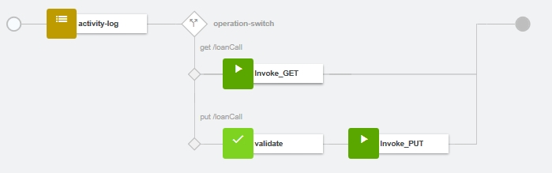
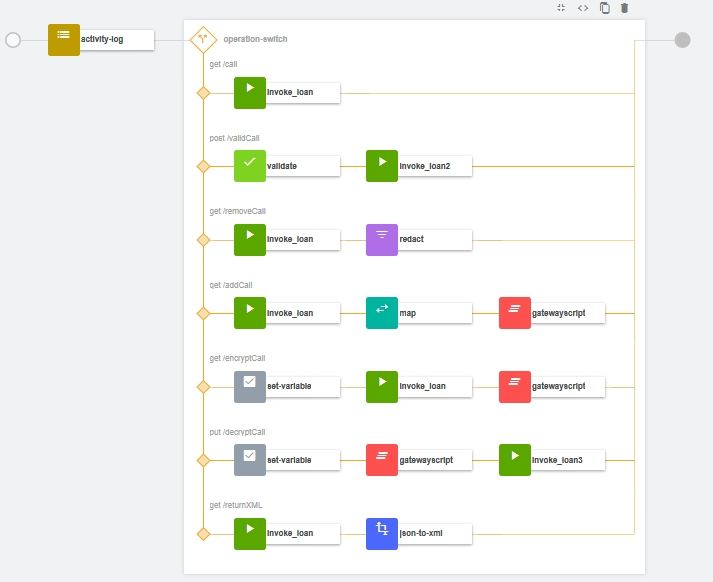
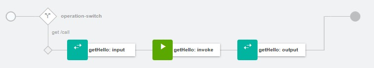
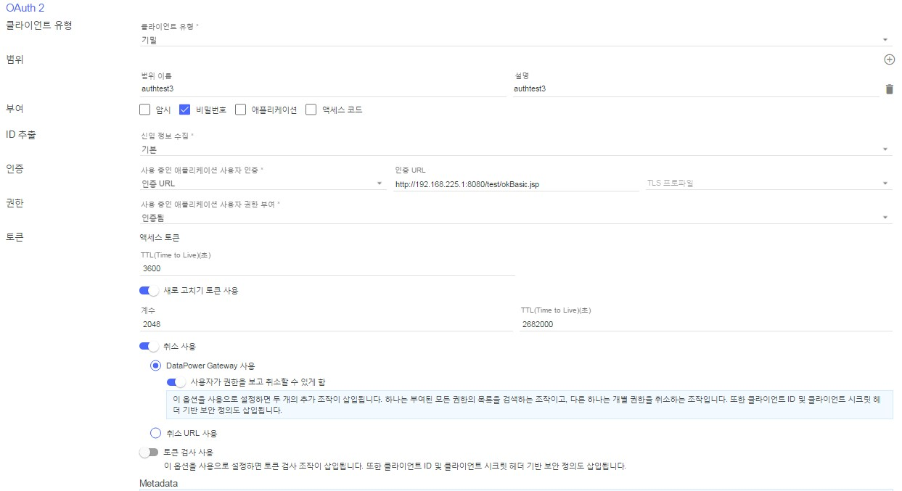

## Sample APIs

> **[참고]** IBM API Connect 의 샘플 API 를 공유하는 공간입니다. 샘플 API 는 Open API 표준(Swagger 2.0)기반으로 작성되었습니다. 

 
|파일명|제공내용|기타|
|:---:|:---:|:---:|
|testapi_1.0.0.yaml|간단한 샘플 API|기본 호출만 존재|
|testloan_2.0.0.yaml|간단한 샘플 API|간단한 정책 테스트 API|
|oauth-2leg_1.0.0.yaml|OAuth 2.0 정의 API|간단한 OAuth 2.0 테스트 API 로서 authtest3_3.0.0.yaml 에서 사용|
|sampleweb_1.0.0.yaml|wsdl 기반으로 Web Service 를 바로 REST 로 변환하는 API||
||||
||||
|LoanTest.zip|API 호출 대상이 되는 간단한 샘플 App|JAX-RS 샘플 App|
|SampleWeb.zip|API 호출 대상이 되는 간단한 Web Service 샘플 App|JAX-WS 샘플 App|

 > testapi_1.0.0.yaml
 
 

 > testloan_2.0.0.yaml
 
 

  > sampleweb_1.0.0.yaml
 
 

 
 
 > oauth-2leg_1.0.0.yaml
 >
 > OAuth 2.0 보안 정의 - Confidential, Password flow, refresh token, revocation
 
 

  